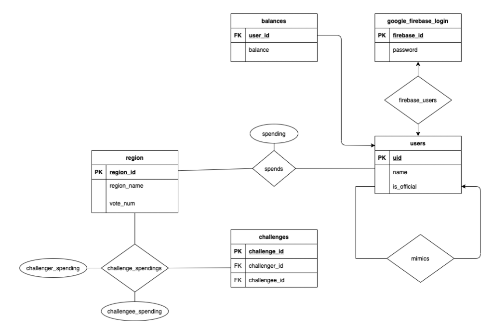

# Political Ads Application

## Description
Our users are anyone who has interests in political data from US presidential selection. We have decided to use the web as our primary user interface since we suspect that the majority of users interested in Facebook’s political advertisement data would prefer a webpage over a command-line interface. 

On our application, a user can create a mock campaign with a set budget. A user will be able to allocate money on advertisements in different regions and then compare their campaign statistics with other regions. We plan on providing graphs and other interesting data visualisation to depict how different politicians target specific demographics and regions. Users can also see how other users allocate funds for different candidates. These analyses are visualized in the form of heat maps and graphs. 

## Tech Stack
Our application is a web application with a GCP database. We used front-end graphing libraries (Chartist, FusionCharts) alongside other web technologies (Vue, D3) to create our application’s user interface. This frontend communicates with a Python Flask backend that is responsible for querying GCP for data and storing user input in GCP. Flask is also used to perform server side post-processing that is inconvenient to perform in SQL. We use the SQLAlchemy python package to work with the database and a Google Cloud Proxy to maintain connections to GCP.

Since the application is a web application, the application is designed to support most modern browsers. While the application was primarily designed for Chrome, it also supports FireFox, Safari, and Edge (i.e. the four major browsers). The application however, does not support mobile devices. In order to ensure the support for these systems, we repeatedly test the application locally using each of these browsers, going over the complete flow. This method particularly was useful for testing the compatibility of the graph libraries we chose and checking for consistency across platforms.

## Instructions
### To create database tables
- `mysql -u root -p us_political_ads -h 34.94.48.96 < createtables.sql` (must enter password)

### To load initial data into database
- Process the raw data you get from Facebooks political ads library report (https://www.facebook.com/ads/library/report)

        - `cd scripts/`
        - `python Facebook.py`
        - `./sort_csv.sh`
        - `./upload_to_db.sh`

### Implemented Features:
#### Landing Page:
- FrontEnd
  - ./app/src/components/HomePage.vue
#### Sign up:
- Backend:
  - ./app/src/python/app.py `register()`
  - ./app/src/python/app.py `get_official_candidates()`
- Frontend
  - ./app/src/store/store.js `postNewUser()`
  - ./app/src/components/SignUpContainer.vue
#### Sign in:
- Backend
  - ./app/src/python/app.py `get_user_information()`
- Frontend
  - ./app/src/store/store.js `postLogin()`
  - ./app/src/components/LoginContainer.vue
#### Updating User Spending:
- Backend
  - ./app/src/python/app.py `update_spending()`
  - ./app/src/python/app.py `regions()`
- Frontend
  - ./app/src/components/SpendingPage.vue
#### Visualize User Spending:
- Backend
  - ./app/src/python/app.py `get_user_spending()`
  - ./app/src/python/app.py `get_user_spending_for_heatmap()`
- Frontend
  - ./app/src/components/SpendingPage.vue
  - ./app/src/components/Chart.vue
  - ./app/src/components/HeatMap.vue
#### Visualize Average Mimic Spending:
- Backend
  - ./app/src/python/app.py `get_average_mimic_spending_headmap()`
- Frontend
  - ./app/src/components/HeatMap.vue
#### Visualize Official Candidate Spending:
- Backend
  - ./app/src/python/app.py `get_user_spending_for_heatmap()`
- Frontend
  - ./app/src/components/HeatMap.vue
#### User Base Statistics
- Backend
  - ./app/src/python/app.py `userbase_stats()`
#### Challenge Creation
- Backend
  - ./app/src/python/app.py `issue_challenge()`
- Frontend
  - ./app/src/components/ChallengePage.vue `startChallenge()`
#### Challenge Retrieval
- Backend
  - ./app/src/python/app.py `get_challenge_history()`
- Frontend
  - ./app/src/components/ChallengePage.vue `created()`

## Database structure

## Team members
- Carmen Kwan
- Clair Hu
- Daniel Tong
- Paul Janiszewski

